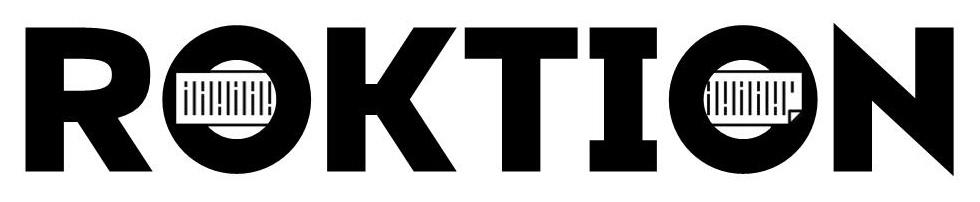
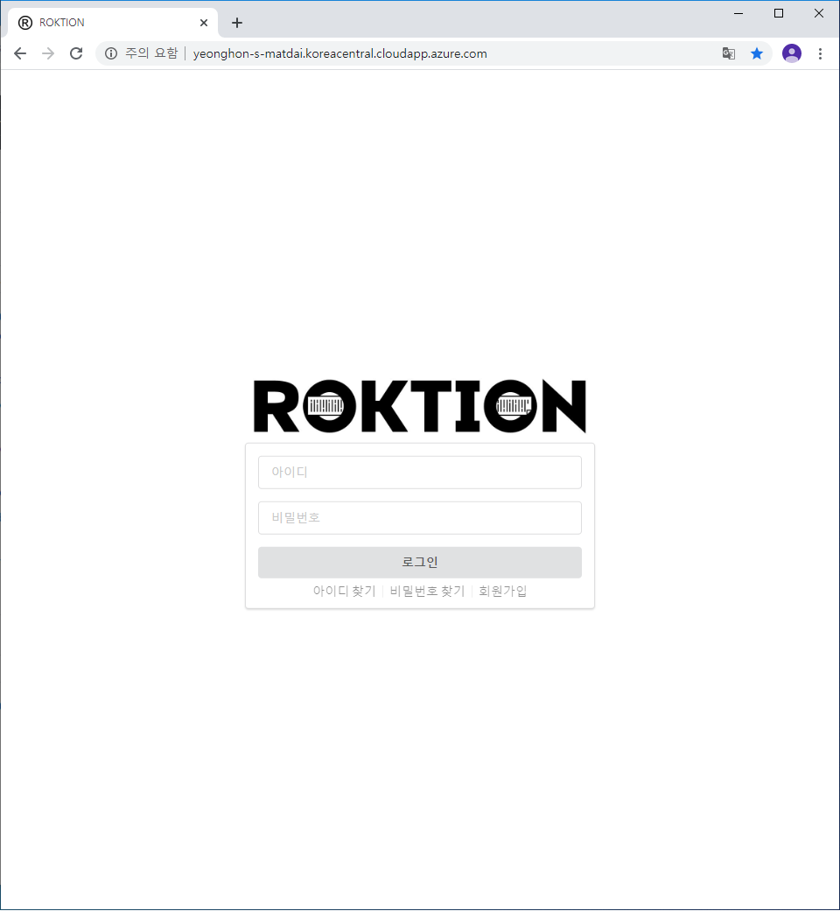
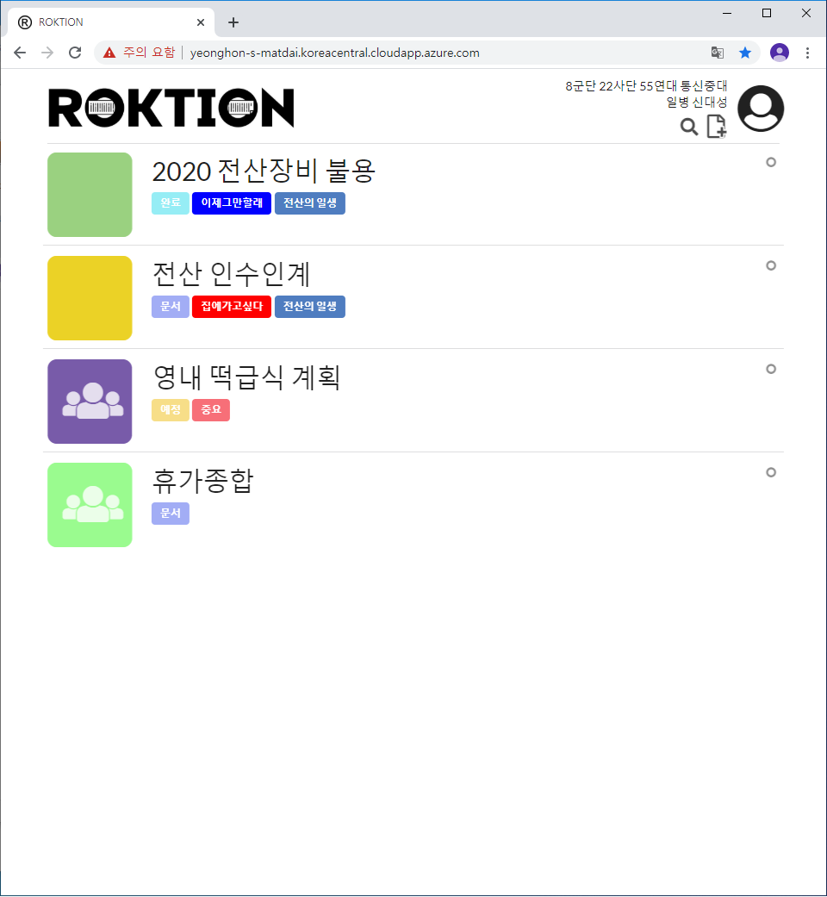
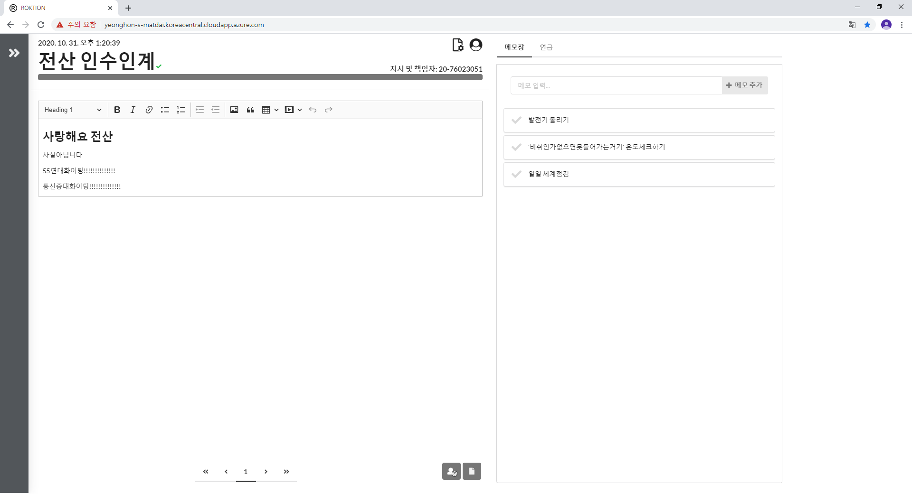

# ROKTION by 영혼의맞다이

<!--팀명 로고 이미지, 팀소개, 프로젝트 설명 (or 동영상)-->
[](http://yeonghon-s-matdai.koreacentral.cloudapp.azure.com)  
로고를 클릭하면 ROKTION에 접속 가능합니다! (09:00 ~ 24:00 만 가능)

# 프로젝트 설명 (Project Information)

## 배경
### 행정병들의, 간부들의 ___애로 및 건의사항___, ROKTION이 조치해드리겠습니다.
- 인수인계 문서를 안전하게 오래오래 유지하고싶지만, 웹메일을 활용하자니 불편하고 수기나 프린트물로 작성하자니 지속적인 수정사항을 반영할 수 없다.
    - 문서를 페이지 단위로 만들어 **서버에 저장한다면?**

- 한가지 큼지막한 업무(ex: 보안감사, 불용장비)에 대해 세부적인 지시사항들을 한 번에 볼 수 있었으면 좋겠다.
    - 문서 하나에 업무 하나를 연결해 작성한다면?
    - 페이지 내부에서 캘린더, 표, 체크박스 등으로 업무를 정리할 수 있다면?
    - 공유해준 **유저를 특정 페이지로 언급**해 업무를 분배할 수 있다면?

- 상관이 자기 컴퓨터 Sticky Notes에 써둔 업무 진행상황을 보고싶은데 직접 가서 보기 너무 힘들다.
    - 소유자가 **문서를 공유**하여 내 컴퓨터에서도 확인 가능하다면?
    - 소유자가 **수정권한을 부여**해 업무 진행상황을 작성하면 동기화되어 다른 업무자도 확인이 가능하다면?

- 메모장으로 인수인계들을 유지하니 난잡한 곳에 저장되고 정리가 힘들다, 어느 메모장에 원하는 내용이 있는지 찾기 힘들다.
    - **태그로 문서를 필터링**하고, **제목으로 문서를 검색**할 수 있다면?
    - 문서별, 페이지별 내용에 대한 검색을 할 수 있다면?

- 맨날 터지는 휴가 정리 시트 싫다.
    - 안전하게 **서버에 저장**할 수 있다면?
    - 짧은 주기로 저장되게 해서 **최대한 손실을 적게** 한다면?

- 내가 업무 지시자인데 계속 카카오톡이나 구두로 지시하는게 힘들고, 전달 오류가 생긴다.
    - 업무 지시 목록을 전달 오류가 적은 **문서 형태로 만들어 서버에 공유**할 수 있다면?
    - 원하는 사람에게만 공유하거나, 공유 문자열을 통해 필요한 사람이 알아서 들어오게 만든다면?
    - 모르는 사항을 추가로 작성해두고 **유저 언급시 알림**이 뜨게 할 수 있다면?

- 전파가 안되어 몇 번이고 다시 교육해야하는 새로운 지침사항! 잘못된 정보가 너무 많이 섞이거나 사람들 사이에 말이 다른 경우 너무 많다!
    - 누구나, 언제 어디서나 접속할 수 있는 **거대한 화이트보드**가 있어서 그 곳에 전파사항을 적는다면? 
    - **실시간으로 변경되는 사항을 반영**하면서 상황을 유연하게 공유할 수 있다면?

## 발표 자료 및 시연 영상

Azure VM를 이용해 호스팅중입니다. (09:00 ~ 24:00 만 사용가능)  
http://yeonghon-s-matdai.koreacentral.cloudapp.azure.com/  
계정 (20-201031 / osam12#$) 로 들어가시면, 발표자료와 사용설명서를 볼 수 있습니다!

[발표 자료 - Google 프레젠테이션](https://docs.google.com/presentation/d/1bNLGSDXlM_uwEnEThKNWNk8AUwsHQF1pA1u1JGQ1Cg4/edit?usp=sharing)

[시연 영상 - Youtube](https://youtu.be/hIOQNU6r0ro)


## 기능 설계

<!--목업 프레임워크 : 카카오 오븐-->
<!--스크린샷 잔뜩-->
[초기 기획 - Kakao Oven](https://ovenapp.io/project/Oe2RQMVa1IWS8jOmZ4S615D2xeDnUJKu#MZCzh)





## 컴퓨터 구성 / 필수 조건 안내 (Prerequisites)

<!--지원 브라우저, 권장 등-->
크롬 사용을 권장합니다.

## 기술 스택 (Technique Used)

### Server (back-end)

<!--사용된 언어, 프레임워크 등-->
- Typescript
- Express
- Mongoose
- Socket.io

### Client (front-end)

<!--프레임워크, 라이브러리 등-->
- Javascript
- React
    - Create-React-App
    - react-color
- Semantic ui
    - semantic-ui-react
- CKEditor 5
- Socket.io-client

# 설치 안내 (Installation Process)

우선 MongoDB를 설치해야 합니다. - [link](https://docs.mongodb.com/manual/administration/install-community/)

MongoDB가 정상적으로 작동되면, ROKTION-server/src/db.ts의 uri 프로퍼티를 작동중인 DB 서버에 맞게 수정합니다.

개발중에는 MongoDB Atlas를 사용합니다. 관련 이슈로 #12 를 참고해주시기 바랍니다.

```bash
$ npm i -g typescript react-scripts yarn
$ cd ROKTION-client && yarn install
$ cd ../ROKTION-server && npm install
```

# 프로젝트 사용법 (Getting Started)

<!--아무거나 적당히 사용법 작성-->
1. ROKTION-client/.env 파일의 HOST를 사용하는 주소에 맞게 수정합니다.
2. /etc/hosts에서 0.0.0.0 \<HOSTNAME> 을 추가합니다.

```bash
$ cd /ROKTION-server
$ sudo npm run dev
```

Azure VM를 이용해 호스팅중입니다. (09:00 ~ 24:00 만 사용가능)  
http://yeonghon-s-matdai.koreacentral.cloudapp.azure.com/

# 팀 정보 (Team Infomation)

## 영혼의맞다이 (Yeonghon-s-Matdai)
- Daeseong Shin (esc990720@gmail.com), [Github link](https://github.com/Merseong)
- Donghu Kim (kty2396@gmail.com), [Github link](https://github.com/I-AM-PROTO)


## 저작권 및 사용권 정보 (Copyleft / End User License)
 * [MIT](https://github.com/Merseong/WEB_ROKTION_Yeonghon-s-Matdai/blob/master/LICENSE)
 
